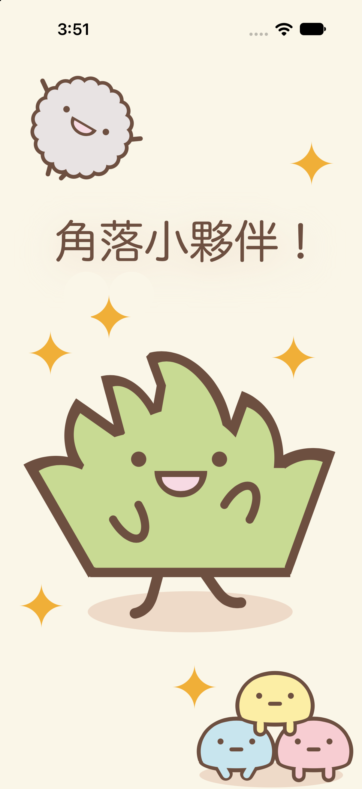

  <h1>🎨 ShapeDraw - 角落生物</h1>
  

    
    
    
  

  
<b>一個完全使用 SwiftUI 內建形狀製作可愛角色圖案的 iOS 繪圖專案 🌈</b>

  
👉 <a href="https://medium.com/@peterabc219/c9156a8b9435">查看 Medium 報告</a>

---

## 📸 作品圖案 (Screenshot)

  

## 📝 專案介紹 (About)

**ShapeDraw** 是一個純粹利用 Swift 內建幾何形狀（如 `Circle`, `Rectangle`, `Capsule` 等等）所拼接與繪製而成的應用程式。
整個角色圖案都是由程式碼「畫」出來的，完全**沒有使用任何外部圖片素材**，藉此練習並展現 SwiftUI 強大的繪圖與排版能力！✨

## 📚 作業說明 (Assignment Details)

此為 **iOS App 程式設計課程作業** —— **「用形狀創作圖案」**。
專案主要目標是透過實作來熟悉 SwiftUI 的圖形功能

📖 **Medium 文章連結：** 👉 [[點此閱讀完整心得報告]](https://medium.com/@peterabc219/c9156a8b9435)
